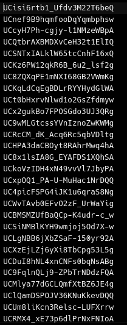
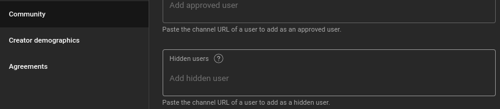
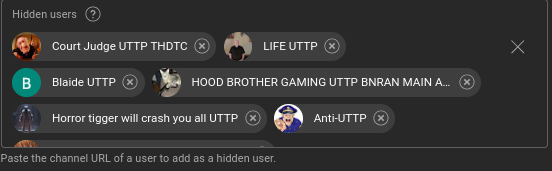

# UTubeTrollKiller

### Say goodbye to the UTTP

Imagine this... You post a fan video of DannoCal, Glitch, SMG4, Game Theory, etc., and then you see a whole load of this being spammed by UTTP crackheads:

> WHO ASKED + UTTP IS BETTER THAN DANNOCAL, GLITCH, SMG4, MURDER DRONES, TADC, AND ALL FANDOMS

Well, you can now kiss goodbye to these duncefucks with UTTK, or UTubeTrollKiller by NXX99. It fetches channel IDs in a console log so you can copy and paste them into youtube studio's blacklist feature!

> **NOTE:** This is a dumbed down version of a script by Switch

## Using the script

## Requirements

* A PC or Mac
* [NodeJS](https://nodejs.org)
* [YoutubeI](https://www.npmjs.com/package/youtubei)

Don't have these? Assuming you have a PC or Mac, here's some steps for various OSes

## Windows Installation

First, open Powershell and install [scoop](https://scoop.sh/)

Second, in a Powershell or CMD window, run `scoop install nodejs`

## MacOS installation

Download and install the package from [the official NodeJS download page](https://nodejs.org/en/download)

## Linux installation

On Debian/Debian based distros (Ubuntu and its flavors, Pop!_os, KDE neon, Q4OS, Linux mint, so on and so forth,) run `apt-get install nodejs`. If you're not root, put sudo before the command.

On RHEL-Based distros (Red Hat, Fedora, CentOS, OpenSUSE, etc.,) run `rpm install nodejs` (`sudo zypper install nodejs` for OpenSUSE,) of course, as sudo if you're not root.

For any other distro (arch, gentoo, or Linux From Scratch,) or other UNIX-Based OSes (Such as BSD distrobutions like FreeBSD and OpenBSD, Solaris,) look up a tutorial on how to install NodeJS.

> ### After installation is finished (no matter what OS you use,) run `node .help`, and install the following dependencies with `npm install x`, where `x` is the dependency:

* `youtubei`
* `fs`
* `terminal-kit`

## Step 1

Clone this repository and CD into it, and run `node index.js`, and you should be seeing a slew of channel IDs separated by commas and spaces. It's best to let it run for a few minutes before stopping.

## Step 2

Kill the script using the CTRL + C or ALT + Q Keyboard combinations, and open `idlist.txt`. You should see something similar to this:

Copy the file's contents.

## Step 3

Go to your [YouTube Studio](https://studio.youtube.com), go to settings in the bottom right corner, and go to Community. Scroll down until you see a text box like this:

Click that and paste. After pasting, save. Double check by going back. After returning to the list, you should see something like this:

If you see something like that, it was a success. No further action is needed.

